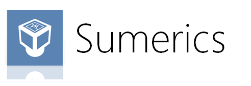
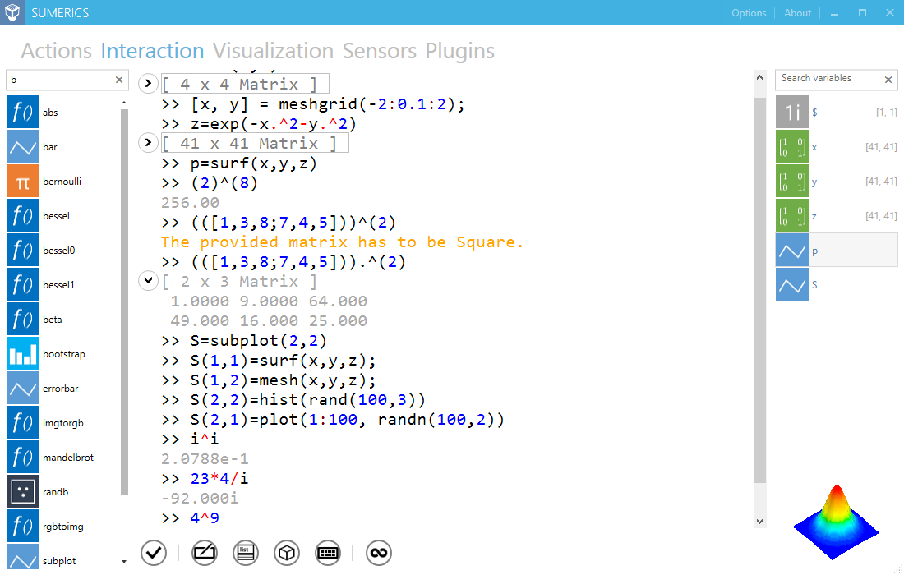
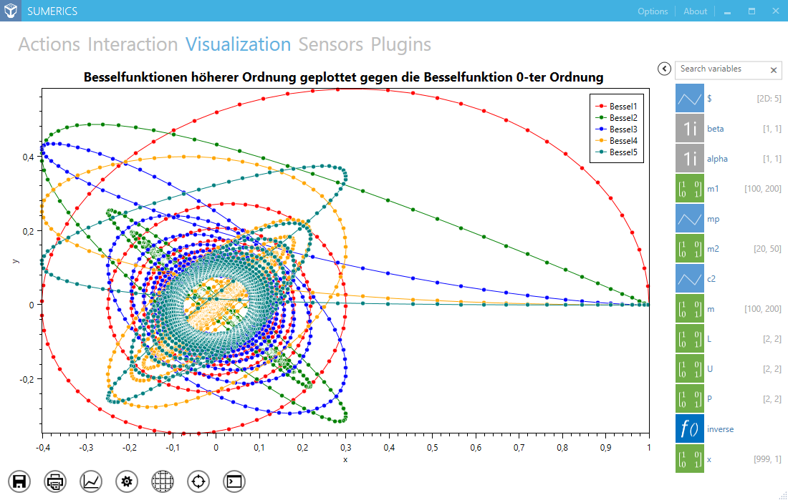
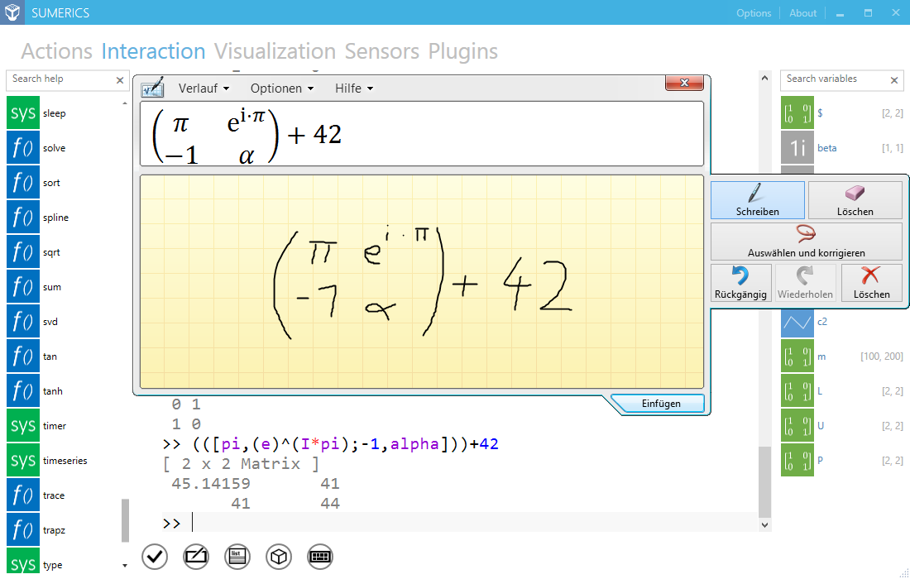
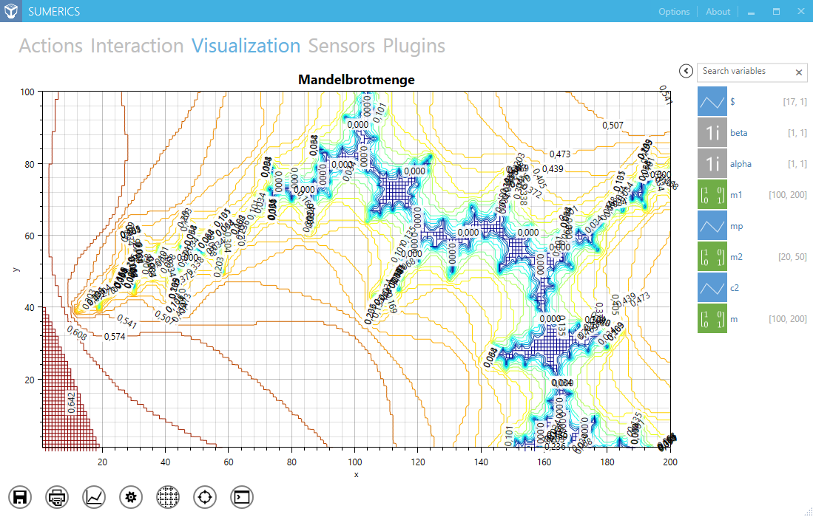
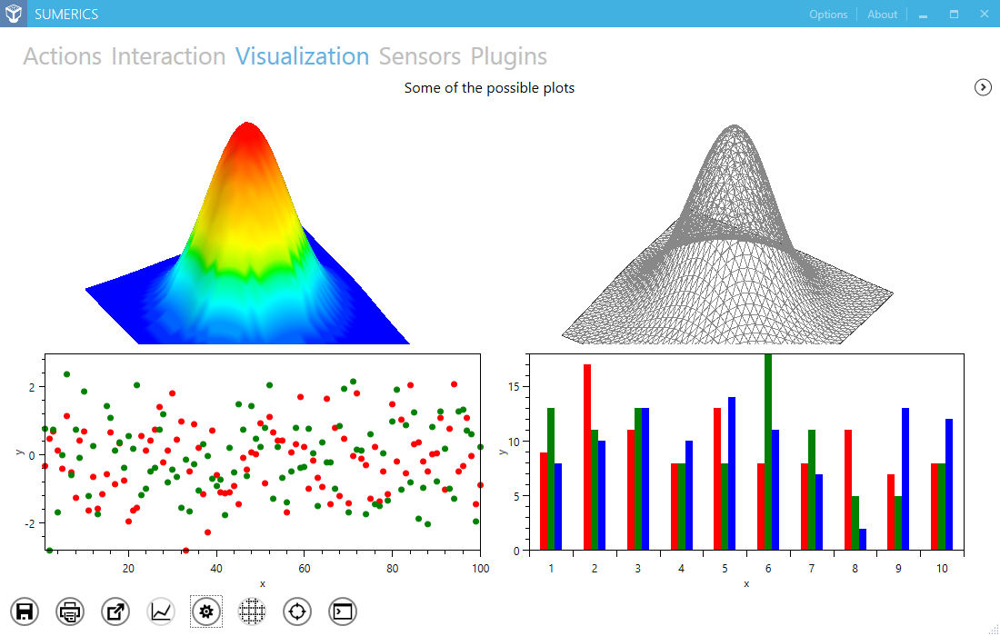

# Sumerics

Sumerics is a touch enabled sensor application for doing numerical calculations on Windows 8+ computers. It is enhanced for the latest generation of Ultrabooks featuring various sensors and a touch screen.

The app is described in greater detail in two articles. One of these articles can be found on [CodeProject](http://www.codeproject.com/Articles/472698/Sumerics), the other has been published [by Intel](https://software.intel.com/en-us/articles/sumerics-case-study).

## Installation

The application is distributed via Chocolatey. The source and installer binary can also be downloaded from GitHub.

## Screenshots

The console view with the REPL to enable a convenient workflow.

The plot view represents the previously added plot object.

Sumerics uses the Windows touch input to recognize touch drawn queries.

There are various kinds of supported plots, e.g., Contour plots.

A group plot type exists to allow displaying a grid of (different) plots.

## Contributions

Contributions in any form are welcome. PRs are happily accepted, as long as the issue is described and solved without creating new issues.

## History

This history only covers the publications that happened regarding the Intel AppUp store. The history of Sumerics vNext will be recorded in form of official releases and attached release notes.

* v2.0.0: *20.04.2016*
  - Release of vNext
  - Complete refactoring
  - Upgraded YAMP

* v1.0.2: *20.02.2013*
  - Fixed some bugs
  - Upgraded YAMP

* v1.0.1: *13.02.2013*
  - Wording enhancements
  - Improved documentation

* v1.0.0: *07.02.2013*
  - Integrated online help
  - Provided the YAMP.Physics plugin

* v0.9.9: *13.12.2012*
  - Included scripting in YAMP
  - Enable the use of plugins

* v0.9.8: *29.11.2012*
  - Integrated the code editor
  - Updated YAMP

* v0.9.7: *28.11.2012*
  - Removed the graphical editor

* v0.9.6: *22.11.2012*
  - Initially published version in the Intel AppUp store

## License

Sumerics - Sensor Numerics Studio
Copyright (C) 2012 - 2016, Simon Mages and Florian Rappl

This program is free software: you can redistribute it and/or modify it under the terms of the GNU General Public License as published by the Free Software Foundation, either version 3 of the License, or (at your option) any later version.

This program is distributed in the hope that it will be useful, but WITHOUT ANY WARRANTY; without even the implied warranty of MERCHANTABILITY or FITNESS FOR A PARTICULAR PURPOSE. See the GNU General Public License for more details.

You should have received a copy of the GNU General Public License along with this program.  If not, see <http://www.gnu.org/licenses/>.